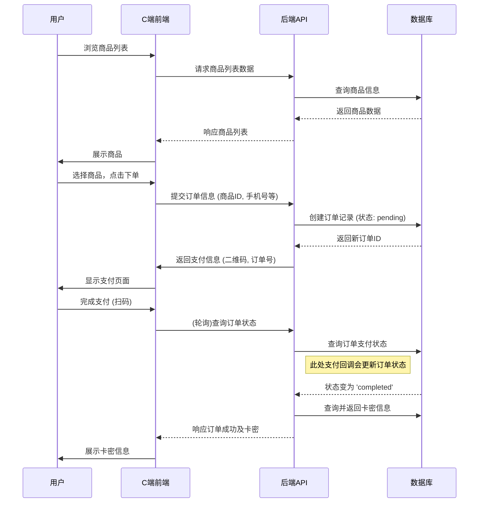

# 项目概述与架构 (Project Overview & Architecture)

---

## 1. 项目简介 (Introduction)

本项目是一个 **24小时自动卡密下单系统**，旨在为小红书等平台的虚拟账号商品提供全天候的自动化销售服务。系统核心流程是用户在线选购商品、完成支付后，能够即时、自动地获取所购买的账号密码（卡密），实现了无人值守的自动化运营。

系统由两大核心部分构成：面向终端用户的 **用户端(C端)** 和面向管理员的 **后台管理系统(B端)**。

## 2. 技术栈 (Technology Stack)

| 分类 | 技术 | 备注 |
| :--- | :--- | :--- |
| **C端前端** | Bootstrap 5, jQuery, AJAX | 注重快速开发和响应式布局 |
| **B端前端** | Vue 3, TypeScript, Element Plus | 现代化、类型安全的企业级中后台方案 |
| **后端服务** | Node.js, Express | 轻量、高效的JavaScript后端框架 |
| **数据库** | MySQL 5.7 | 成熟稳定的关系型数据库 |
| **图片存储** | 七牛云对象存储 | 专业、可靠的云存储服务 |
| **自动化测试**| Node.js, axios, chalk | 保证API接口质量和稳定性 |

## 3. 系统架构图 (System Architecture)

```mermaid
graph TD
    subgraph 用户 (User)
        A[浏览器/移动设备] --> B{用户端 (C端)};
    end

    subgraph 管理员 (Admin)
        C[浏览器] --> D{管理端 (B端)};
    end

    B --> E[后端API服务 (Node.js)];
    D --> E;

    E --> F[MySQL数据库];
    E --> G[七牛云对象存储];

    style B fill:#cde4ff
    style D fill:#d5e8d4
    style E fill:#f8cecc
    style F fill:#ffe6cc
    style G fill:#dae8fc
```

**架构说明:**
- **用户/管理员** 通过浏览器访问前端应用。
- **前端应用 (C端/B端)** 作为用户交互界面，调用后端API服务处理业务请求。
- **后端API服务** 是系统的核心，负责处理所有业务逻辑、数据读写、用户认证等。
- **MySQL数据库** 存储所有核心业务数据，如用户信息、商品、订单等。
- **七牛云** 负责存储需要持久化的文件，主要是商品图片和截图。

## 4. 核心业务流程图 (Core Business Flow)

### 用户购买流程



